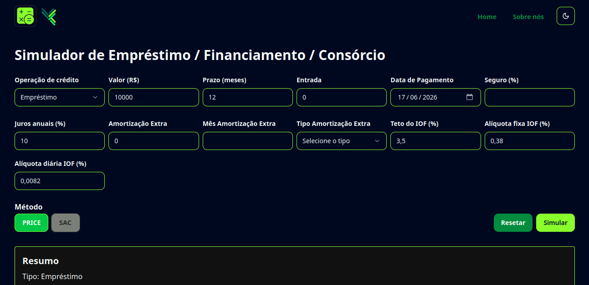

# Você Calcula 🧮

Hub de calculadoras utilitárias construído com React e Next.js, focado em organização de código, experiência de usuário e práticas modernas de desenvolvimento front-end.

---

## Preview



---

## Sobre o projeto

O **Você Calcula** é uma aplicação web que reúne diferentes ferramentas de cálculo do dia a dia, como finanças, saúde e matemática.

O projeto foi criado com foco em prática de desenvolvimento front-end moderno, incluindo componentização, consumo de APIs, validação de dados e organização por módulos (*feature-based architecture*).

A ideia é simular um produto real, com escalabilidade e manutenção em mente.

Obs.: Este repositório é do FRONT-END da aplicação. Para ver o BACK-END acesse o repositório [voce-calcula-backend](https://github.com/davihenriquedev1/voce-calcula-backend/)

---

## Funcionalidades

- **Saúde**
  - Calculadora de IMC
  - Calculadora de TMB (Taxa Metabólica Basal)

- **Finanças**
  - Conversor de moedas (API externa)
  - Simulador de investimentos
  - Calculadora de empréstimos com tabela de amortização

- **Matemática**
  - Calculadora científica

- **Interface**
  - Tema claro/escuro
  - Animações de interface

---

## Tecnologias


---

## Como rodar o projeto

```bash
git clone https://github.com/davihenriquedev1/voce-calcula.git

cd voce-calcula
npm install
````

Crie um arquivo `.env` baseado no `.env.example` (caso necessário).

Depois rode o projeto:

```bash
npm run dev
```

A aplicação ficará disponível em:
[localhost:3000](http://localhost:3000)

---

## Estrutura do projeto

O projeto segue uma organização baseada em features, separando responsabilidades por domínio:

```
/src
  /app           # Rotas (Next.js App Router)
  /components    # Componentes reutilizáveis
  /features      # Módulos da aplicação (bmi, loans, etc.)
  /hooks         # Hooks personalizados
  /providers     # Contextos globais
  /utils         # Funções auxiliares
```

---

## Melhorias futuras

* Melhorias de performance em tabelas grandes
* Aumento da cobertura de testes
* Adicionar mais páginas de calculadoras diversas
* Melhorias de acessibilidade


---


Acesse o site:
[voce-calcula.vercel.app](https://voce-calcula.vercel.app)
